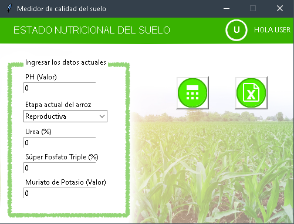
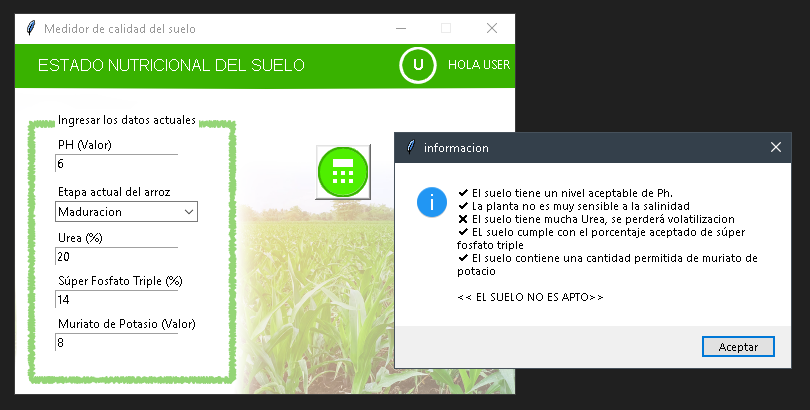

# QUALITY SOIL
Indicates if the soil quality is suitable through several factors.

# Descripción

Este software compara los valores ingresados por el usuario con los valores recomendados, de esta manera determina si el suelo
es apto o no. Tambien guarda los datos ingresados en un archivo de excel para ser compartidos o mantener un registro.

Para iniciar secion se encuentra registrada una cuenta de ejemplo llamada **user** y con contraseña **12345**

# Capturas de pantalla

## desarrollador 
<a style="color:#26495d" href="https://github.com/Tomvargas/">@Tomvargas</a>
